<h1 align="center">Hi there, I'm Pangeran 👋</h1>

  

  

 

---

<h3 align="center">Connect With Me</h3>

   &nbsp;&nbsp; 
   &nbsp;&nbsp;
  
  
  
  

 

---

<h3 align="center">Github Stats</h3>

  
  

 

---

<h3 align="center">Tech Stack & Tools</h3>

  

 

---

<h3 align="center">Contribution Activity</h3>

  <picture>
    <source
      media="(prefers-color-scheme: dark)"
      srcset="https://raw.githubusercontent.com/pangeran-droid/pangeran-droid/pacman-output/pacman-contribution-graph-dark.svg"
    />
    <source
      media="(prefers-color-scheme: light)"
      srcset="https://raw.githubusercontent.com/pangeran-droid/pangeran-droid/pacman-output/pacman-contribution-graph.svg"
    />
    
  </picture>

