<h1 align="center">pangeran</h1>
<h4 align="center">pangeran-droid</h4>

Informatics student focused on web development & cybersecurity.

  
  

 

  

 

  This card refreshes automatically every day via GitHub Actions — live stats, no manual edits needed.

### contribution activity

  <picture>
    <source
      media="(prefers-color-scheme: dark)"
      srcset="https://raw.githubusercontent.com/pangeran-droid/pangeran-droid/pacman-output/pacman-contribution-graph-dark.svg"
    />
    <source
      media="(prefers-color-scheme: light)"
      srcset="https://raw.githubusercontent.com/pangeran-droid/pangeran-droid/pacman-output/pacman-contribution-graph.svg"
    />
    
  </picture>

